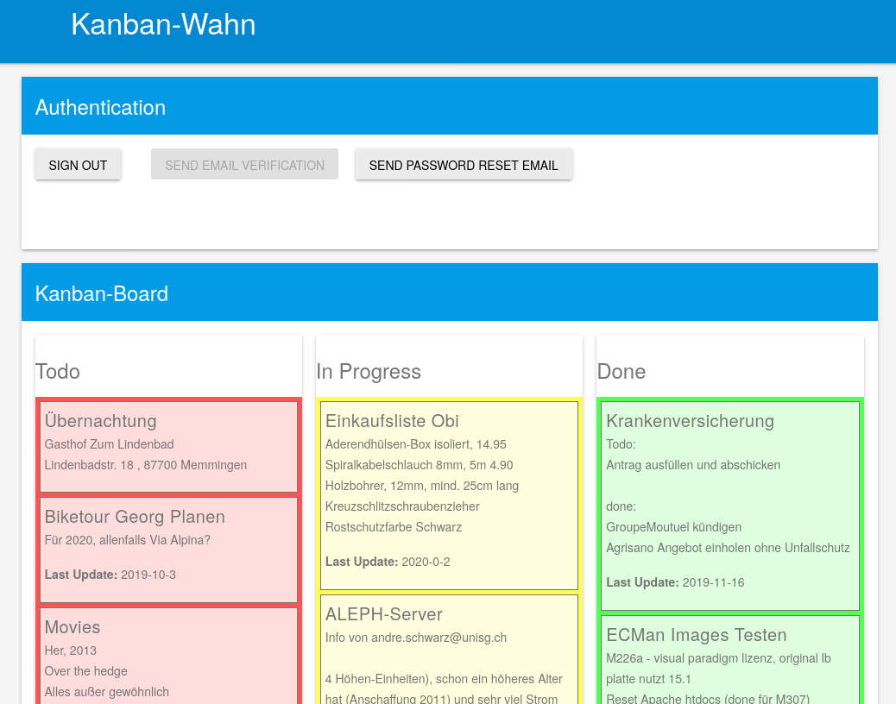

# Kanban-Wahn

* a simple Firebase-based WebApp for Todo-lists
* somewhat mobile friendly :P

## Setup:

* create your own firebase app ([https://firebase.google.com/](https://firebase.google.com/))
* add a new file `apikey.js` into `public/js`
* add your own Firebase-credentials

```json
const firebaseConfig = {
  apiKey: "yourkey",
  authDomain: "yourapp.firebaseapp.com",
  databaseURL: "https://yourapp.firebaseio.com",
  projectId: "yourproject_id",
  storageBucket: "yourapp.appspot.com",
  messagingSenderId: "12345678",
  appId: "yourapp_id",
  measurementId: "yours..."
};
```
## Development

* to push local changes, run `firebase deploy` from project root directory
* `firebase login --reauth` helps sometimes

## Screenshot


